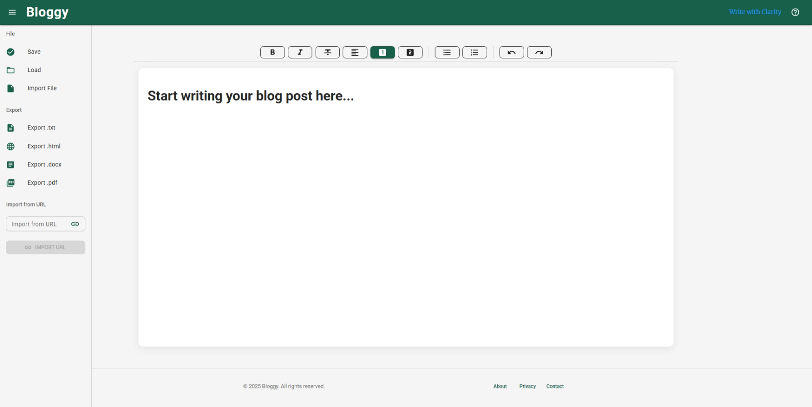

# Bloggy – Modern Blog Writing Tool



---

## 🚀 Overview
Bloggy is a modern, web-based blog writing tool focused on clarity, accessibility, and a delightful writing experience. It features a rich text editor, seamless file import/export, and a professional, branded UI.

---

## 🛠️ Tech Stack
### Frontend
- **React** (Vite-powered)
- **TypeScript**
- **TipTap** (rich text editor)
- **Material UI (MUI)** for UI components and theming
- **@mui/icons-material** for iconography
- **Axios** for HTTP requests

### Backend
- **Node.js** + **Express** (TypeScript)
- **REST APIs** for post management and file import/export
- **mammoth** for .docx import
- **pdfjs-dist** for .pdf import
- **docx** for .docx export
- **puppeteer** for .pdf export

### Other
- In-memory post storage (can be replaced with a database)
- CORS proxy for URL imports
- Modular, accessible, and responsive design

---

## ✨ Features
- **Rich Text Editing:** Medium-like experience powered by TipTap and MUI
- **Formatting Toolbar:** Bold, italic, headings, lists, undo/redo, and more
- **Sidebar:** Save/load posts, import/export (.txt, .docx, .pdf, .html), import from URL
- **Notifications:** Branded, accessible, and with icon support
- **Responsive Layout:** Drawer sidebar, AppBar, and footer adapt to all devices
- **Accessibility:** ARIA labels, keyboard navigation, and focus management
- **Branding:** Custom theme, colors, fonts, favicon, and page title

---

## 📁 Project Structure
```
blog-writing-tool/
├── client/           # Frontend React app (see src/ for main code)
├── server/           # Backend Express API
├── src/
│   ├── App.tsx       # Main app, layout, and logic
│   ├── components/   # Modular UI components (MenuBar, SideBar, SnackbarQueue)
│   ├── theme.ts      # Brand color/font tokens
│   └── muiTheme.ts   # MUI theme setup
├── BRAND_GUIDE.md    # Brand colors, fonts, and UI guidelines
├── image.png         # App screenshot
└── README.md         # This file
```

---

## ▶️ Getting Started
1. **Install dependencies:**
   ```sh
   npm install
   ```
2. **Start the frontend:**
   ```sh
   npm run dev
   ```
3. **Start the backend:**
   See `/server` for details.

---

## 📚 Brand Guide
See [`BRAND_GUIDE.md`](./BRAND_GUIDE.md) for full details on colors, fonts, and UI guidelines.

---

## 🤝 Contributing
Pull requests and issues are welcome! Please follow the brand and code guidelines.

---

## © {new Date().getFullYear()} Bloggy. All rights reserved.


